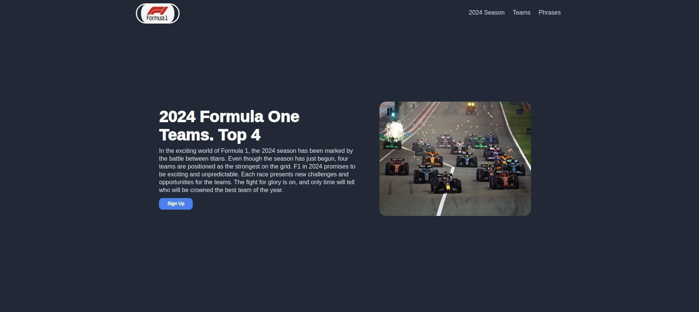

# Formula One Page 🏎️

> Landing Page Project inspired by Formula 1, a unique blend of high-performance racing, cutting-edge technology, teamwork, and individual brilliance, making it a truly captivating sport.

F1 page is inspired by the Landing Page of The Odin Project. It has several sections whose theme is formula one, each of these contains an aspect in relation to the sport, including the top 4 best teams according to the results of the 2024 season. It also includes a list of phrases said by drivers on different occasions. Finally, the page has a direct link to the official F1 page in case you are interested in knowing more about the topic.

## Built With

- HTML-CSS
- Technologies used: Git - GitHub

## Live Demo

[Live Demo Link](https://zayleth.github.io/F1-Landing-Page/)

## Getting Started

Clone the repository in Git, run it from a browser.

## Authors

👤 **Zayleth Vegas**

- GitHub: [@Zayleth](https://github.com/Zayleth)
- Instagram: @zaylethvs
- LinkedIn: [LinkedIn]

## 🤝 Contributing

Contributions, issues, and feature requests are welcome!

Feel free to check the [issues page](https://github.com/Zayleth/F1-Landing-Page-/issues).

## Show your support

Give a ⭐️ if you like this project!

## Acknowledgments

- Use this project as inspiration to get started in the world of CSS and Flexbox. 
- Please note that the main "Sign Up" button does not lead to any route because it was made with the objective of practicing decoration.
- Inspiration: Landing Page - The Odin Project, Pinterest, F1 Page. 

## 📝 License

This project is [CC0 1.0 Universal](LICENSE) licensed.